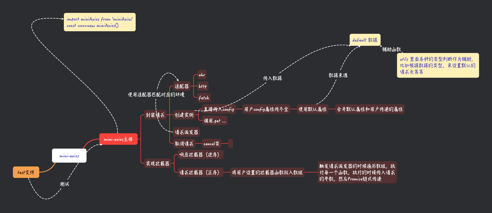

# mini-axios
## 简化部分
- 对default的类型进行判断
- 简化default，简易版本


## 实现了什么

- 适配器（xhr，http，fetch）
- axios的使用方式
- 拦截器


## 使用方式
```js
import './boundle.js'

miniAxios.interceptors.request.use(
    (response) => {
      console.log("响应拦截器1: 格式化数据");
      response.data = {
        success: true,
        payload: response.data,
      };
      
      return response;
    },
    (error) => {
      console.error("响应拦截器1错误:", error);
      return Promise.reject(error);
    }
);
miniAxios.get({
    url: 'https://jsonplaceholder.typicode.com/users'
}).then(response => {
    console.log(response.data);
}).catch(error => {
    console.error('There was an error!', error);
});
miniAxios({
  method: 'GET',
  url: 'https://jsonplaceholder.typicode.com/users'
}).then(res => {
  console.log(res)
})
```

## TODO
- 优化打包结构
- 实现取消请求


## 图示


